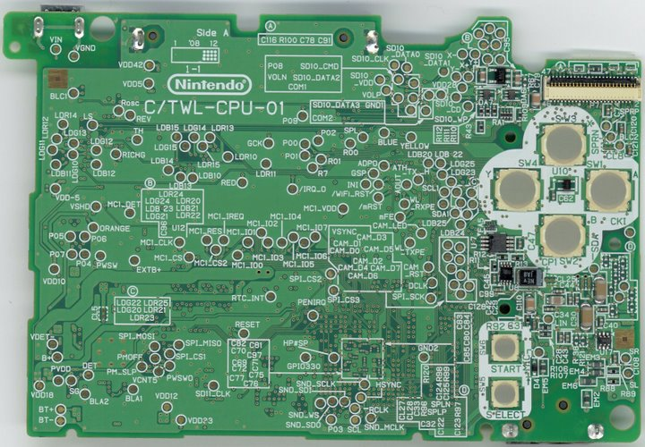
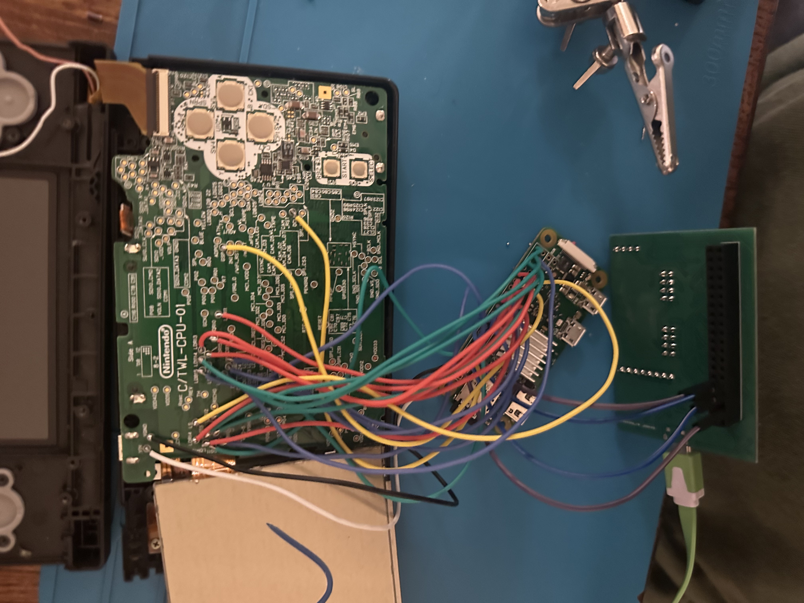

# DSi HDMI — Nintendo DSi Video Output for Raspberry Pi Zero

Bare-metal Raspberry Pi Zero firmware that captures video from a Nintendo DSi screen (top or bottom) and outputs it via HDMI.

## Demo

[YouTube demo](https://www.youtube.com/shorts/CB0fu9gu2rI)

## Context

- **About this repo**: it was generated/packaged with the help of AI to clean up the code layout/style and to make it easy to build + run as a standalone release repo - if there are any issues building please flag them as this software is tested/working.
- **Support**: if the build or SD-card boot process doesn’t work on your setup, please open an issue with your OS/toolchain version and the full build output.
- **Credit**: this project heavily relies on the excellent bare-metal Raspberry Pi infrastructure provided by the **CS140e staff** (vendored here as `libpi/`, plus boot/firmware conventions). Any mistakes are in copying over the files to this separate repo.

## Features

- Real-time capture from DSi LCD (256×192, 6-bit RGB)
- HDMI output at 320×240 (2× scale)
- DMA-based GPIO sampling
- MMU + cache for performance

## Known limitations

- **Artifacting**: due to Raspberry Pi Zero capture limits, some lines may be consistently copied from the line directly above. This is generally minor - and not easily noticeable unless you look for it specifically.
- **Performance**: runs at ~**24 FPS** on a Pi Zero.

## Supported Boards

- **Raspberry Pi Zero**
- **Raspberry Pi Zero W**

Only these boards are supported (BCM2835). Pi Zero 2, Pi 1 Model B+, and other variants are not tested.

## Bill of Materials

- **Raspberry Pi Zero / Zero W**
- **microSD card** (FAT32 for the boot partition)
- **Nintendo DSi** (to tap the LCD signals)
- **mini-HDMI → HDMI adapter/cable** (Pi Zero uses mini-HDMI)
- **USB power cable/supply** (and optionally a **USB OTG adapter** if you want peripherals for debugging)

## Quick Start — SD Card (No Build)

1. Copy all files from the `release/` folder to a FAT32 SD card (or download from [releases](https://github.com/Gymnast544/dsi-hdmi-rpi-zero/releases)).
2. Boot the Pi Zero.

See [release/README.md](release/README.md) for detailed SD card setup.

## Hardware Installation

### DSi motherboard test points

`assets/Twl_back.jpg` is a photo of the DSi motherboard (back side) with the relevant test points labeled.



Image credit: [DSiBrew — File:Twl_back.jpg](https://dsibrew.org/wiki/File:Twl_back.jpg)

#### Color signal label format

The labeled color test points follow the format **`LD<C><S><B>`**:

- **`C`**: color channel — `R`, `G`, or `B`
- **`S`**: screen number — `1` = bottom screen, `2` = top screen
- **`B`**: bit index — `0` through `5`

In addition, **`LS`**, **`GSP`**, and **`DCLK`** are labeled on the image.

#### Power / ground notes

- **Ground**: `VGND` near the charging port works well for ground.
- **Optional DSi power from the Pi**: you can connect **5V** to **`VIN`** (also near the charging port) if you want the Pi to power/charge the DSi.

### Example installation

`assets/hardware_installed.jpeg` shows an example of what a **bottom-screen** installation can look like. (For top screen capture, you’ll solder to different test points on the DSi motherboard, but the overall approach is the same.) This is super messy, and there's a lot of room for improvement and cleanliness on the hardware side.




### Pinout

GPIO 0–3 are avoided (hardware 1.8kΩ pull-ups on PCB). GPIO 14/15 are reserved for UART TX/RX, which was mainly used for testing/development.

`assets/rpi pinout.png` is a helpful reference for the Raspberry Pi header orientation/pin numbering.


Source: [GPIO Pinout Orientation Raspberry Pi Zero W (Stack Exchange)](https://raspberrypi.stackexchange.com/questions/83610/gpio-pinout-orientation-raspberry-pi-zero-w)

Power / ground hookups:

- **GND**: Pi **Pin 6 (GND)** → DSi **`VGND`**
- **5V (optional)**: Pi **Pin 2 (5V)** → DSi **`VIN`** (to power/charge the DSi from the Pi)

> **Note:** Pin 31 (GPIO 6) is physically wired to **LS** (line sync) on the DSi. The code refers to this signal as GCK — they are the same signal.

| Pi Physical Pin | DSi Signal  |
|-----------------|-------------|
| Pin 7           | DCLK        |
| Pin 8           | *(UART TX)* |
| Pin 10          | *(UART RX)* |
| Pin 11          | G[1]        |
| Pin 12          | G[2]        |
| Pin 13          | B[5]        |
| Pin 15          | B[0]        |
| Pin 16          | B[1]        |
| Pin 18          | B[2]        |
| Pin 19          | R[3]        |
| Pin 21          | R[2]        |
| Pin 22          | B[3]        |
| Pin 23          | R[4]        |
| Pin 24          | R[1]        |
| Pin 26          | R[0]        |
| Pin 29          | GSP         |
| Pin 31          | LS          |
| Pin 32          | R[5]        |
| Pin 33          | *(spare)*   |
| Pin 35          | G[3]        |
| Pin 36          | G[0]        |
| Pin 37          | B[4]        |
| Pin 38          | G[4]        |
| Pin 40          | G[5]        |


## Building from Source

### Prerequisites

- **arm-none-eabi-gcc** toolchain (e.g. `arm-none-eabi-gcc` from [Arm GNU Toolchain](https://developer.arm.com/downloads/-/arm-gnu-toolchain-downloads) or your distro’s `gcc-arm-none-eabi` package)

No other repos or external dependencies — libpi is vendored in this repo.

### Build

```bash
git clone https://github.com/Gymnast544/dsi-hdmi-rpi-zero.git
cd dsi-hdmi-rpi-zero

# Build for SD card (runs indefinitely):
make SD_BOOT=1

# Or build and prepare release folder:
make release
```

### Output

| Target | Output |
|--------|--------|
| `make SD_BOOT=1` | `src/dsi-hdmi.bin` |
| `make release` | `release/kernel7.img` — ready to copy to SD card |

## Project Structure

```
dsi-hdmi-rpi-zero/
├── src/
│   ├── dsi-hdmi.c       # Main capture + display loop
│   ├── gpu-fb.c/h       # Framebuffer / HDMI via mailbox
│   ├── mbox.c/h         # GPU mailbox
│   ├── mmu.c, mmu-asm.S # MMU + cache
│   ├── vm-cache.h       # Cache setup for DMA
│   └── armv6-*.h        # ARM coprocessor definitions
├── libpi/           # Vendored Raspberry Pi bare-metal library
├── release/         # SD card files (after make release)
│   ├── kernel7.img  # Built kernel — copy to SD card
│   ├── bootcode.bin, start.elf, config.txt
│   └── README.md    # SD card setup instructions
└── Makefile
```

## License

MIT.

## Next steps

- **Hardware installation + packaging guide**: write up a full build guide including wiring, a flex PCB option, and packaging (e.g., a 3D-printed shell).
- **Raspberry Pi Zero 2 W support**: add support for Pi Zero 2 W to increase FPS and (hopefully) reduce artifacting.

I probably won’t have time to execute all of these myself, but I’d love to be a resource if you want to take any of them on.
